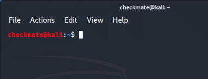
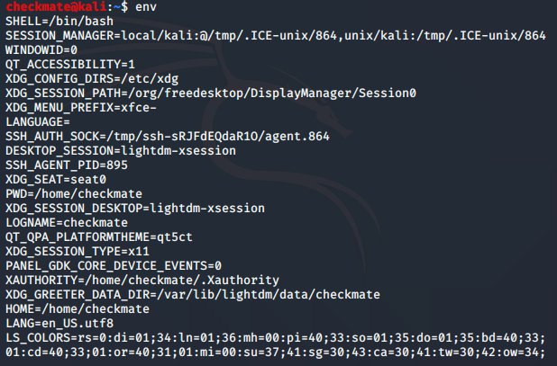
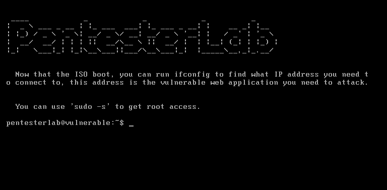
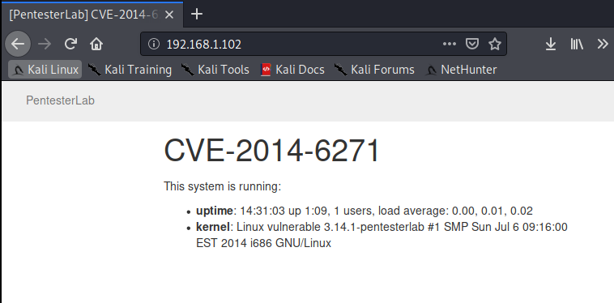
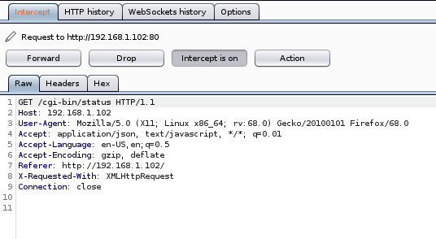
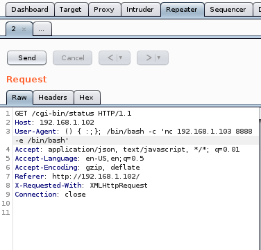

# Shellshock-Bash-Remote-Code-Execution-Vulnerability-and-Exploitation

Before moving into the shellshock vulnerability, everyone should know about the bash environment. So let move on the bash.

When your computer boots up, kernal will identify each and every hardwares and components which are enabled. Each and every computers which are using UNIX kernal they will have this shell for operates outside of the kernal. This will allows everyone to interact with the computer. And also Bash is one of the most popular, the most powerful, and the most friendly application in the computer.

Let&#39;s move on with the Linux systems. There is a terminal. When you start it, it is running with the Bash shell. This shell is usually use a dollar sign($) as a symbol.

Shell is waiting for an input is the message of that sign. So you can use any type of command which is compatible.

# /bin/bash

Using &#39;which&#39; command we can view a location of the bash in your system.

Bash supports environment variables.

And also using bash you can invoke existing environment variables as well as you can add new ones. By using bash we can create special functions which are called bash functions. Those are most commonly use as bash scripts. To bash scripts we are using &#39;.sh&#39; extension. And also we should add &quot;#!/bin/bash&quot; as a header of that relevant bash script file. According to the header kernal will understand what kind of a script you are going to execute.

And also there is a feature to defined functions in the environment variables.

Let&#39;s move on to the shellshock vulnerability

**What is shellshock?**

This is called as &#39;Shellshock Bash Remote Code Execution Vulnerability&#39;. This vulnerability is a security bug which is coming with bash to execute commands from environment variables unintentionally. In case of the exploitation will allow a remote connection to server or machine and also attacker can executed command remotely which is known as remote code execution. This is easiest one for exploit because not only the bash is using environment variables. Internet services, network services as well as web services also using environment variables. So the probability of the facing in attack is really high.

Main issue is, environment variables are not sanized properly before executed. So attackers can send commands to the server using HTTP requests and executed them on web server operating system. This vulnerability is discovered by Stephane Chazelas and also it has assigned CVE-2014-6271 as a CVE identifier. This is identical to CVE-2014-7169 which is discovered by Tavis Ormandy.

This attack can be done by two methods.

1. By using HTTP request
2. By using metasploit

In here we are going to talk about each and every methods we can carried out this attack. Those two ways are going to take bash environment of the victim machine remotely.

Before moving to the attack, we should have to create our lab environment.

**Lab Environment**

To do this demonstration we need two VMs or else Linux machine with one VM. For Linux machine you need either kali linux or any other linux operating system with the few pentesting tools (Burp suite, metasploit,nmap and etc.).

We are going with other way. It means this demonstration will be conduct by using two VMs. One is for kali linux and other for vulnerable OS. For vulnerable OS we are not going to use full operating system. So we are using OS which is specially created for shellshock vulnerability by pentesterLab. You can download it using below link.

Link for ISO file: [https://www.vulnhub.com/entry/pentester-lab-cve-2014-6271-shellshock,104/](https://www.vulnhub.com/entry/pentester-lab-cve-2014-6271-shellshock,104/)

After downloading you should install it to the VM with proper configurations and run it.

For other VM you should install kali linux or else you can use any linux distribution with some pentesting tools (Burp suite, metasploit,nmap and etc.).

**How to attack using HTTP request?**

This shellshock VM has open port 80 with an assigned web service. This is act as a web server. So we can view that web service using kali machines web browser(Kali machine and the shellshock machine should be in the same network).

Then we need &#39;Burp suite &#39; or &#39;Nikto&#39; to capture this HTTP request. In this case we are going to use &#39;Burp suite&#39; to capture the request. After the capturing that web request, we have to change that request and send it back as well as we have listen special port by using kali linux machine.

After capturing this request you can see there is a GET request. In that get request they mentioned special path which is /cgi-bin/status. This path is to be the path to inject our script. In below image also shows that path on web site which hosted on port 80.

By using burp suite repeater we can send the script to this path.

In below image shows injected script.

We added listner on the kali machine which reads shellshock machines bash. Also we have to add listen to port 8888 by using kali machine.

After this, we have to send that HTTP request using burp suite repeater. Then you can see kali machine is connected to the shellshock machine&#39;s bash. And aslo below image shows few commands run on shellshock machine&#39;s bash using kali machine.

